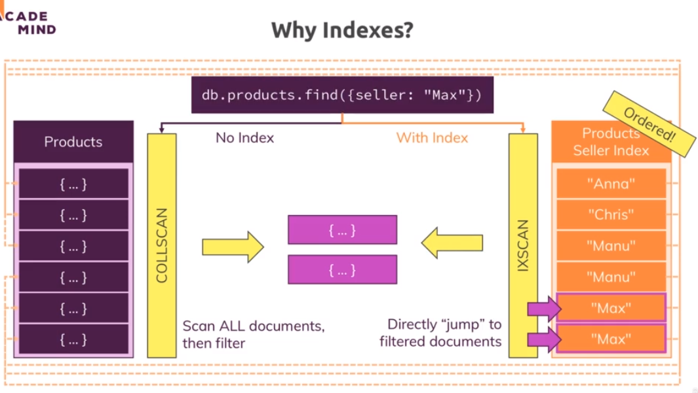
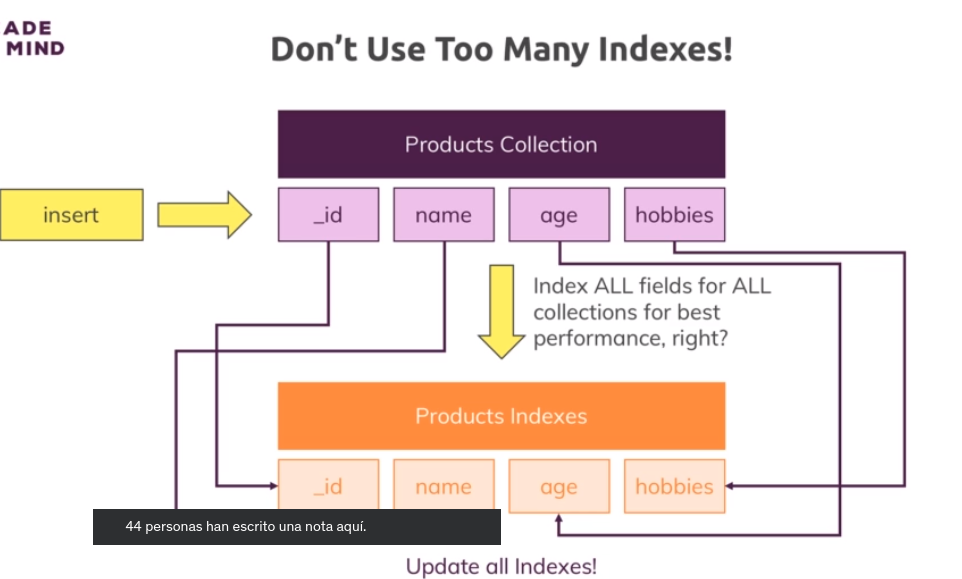

# 8-Working-Indexes
1. [What Are Indexes & Why Do We Use Them?](#schema1)
2. [Adding a Single Field Index](#schema2)
3. [Understanding Index Restrictions](#schema3)


<hr>

<a name="schema1"></a>

## 1. What Are Indexes & Why Do We Use Them?

En MongoDB, un índice (o index en inglés) es una estructura de datos que mejora la velocidad de las consultas en una 
colección. Los índices permiten a MongoDB buscar y recuperar documentos de manera más eficiente al utilizar un 
conjunto de reglas definido para acceder y ordenar los datos almacenados en la base de datos.

Aquí hay algunas características y conceptos clave sobre los índices en MongoDB:

**Mejora del Rendimiento:**

Los índices mejoran la velocidad de las consultas porque permiten a MongoDB evitar escanear toda la colección 
en busca de documentos que cumplan con un criterio específico.
Sin índices, MongoDB realizaría una búsqueda secuencial, revisando cada documento para determinar si cumple con la 
consulta. Los índices proporcionan un método más eficiente para buscar y recuperar datos.

**Estructura de Árbol-B:**

Internamente, MongoDB utiliza una estructura de árbol-B para almacenar índices. 
Esta estructura facilita la búsqueda y la clasificación eficientes de datos.

**Cobertura de Consultas:**

Un índice puede cubrir una consulta si contiene todos los campos necesarios para ejecutar la consulta sin 
tener que buscar en la colección principal. Esto puede mejorar significativamente el rendimiento al evitar la 
necesidad de acceder a los documentos principales.

**Creación Manual o Automática:**

Puedes crear índices manualmente especificando los campos y el tipo de índice.
MongoDB también crea índices automáticamente en algunos casos, como para el campo _id o cuando se crea un índice único.

**Tipos de Índices:**

MongoDB admite varios tipos de índices, incluidos índices simples, índices compuestos (que involucran múltiples campos)
y índices geoespaciales (para consultas espaciales).

**Actualizaciones y Mantenimiento:**

La adición y eliminación de índices puede afectar el rendimiento y el espacio en disco, ya que los índices 
deben actualizarse cuando se insertan, actualizan o eliminan documentos.

**Expiración de Datos:**

MongoDB admite índices con expiración de datos (TTL indexes) que permiten eliminar documentos automáticamente después 
de un período de tiempo específico.

**Visualización de Índices:**

Puedes ver la lista de índices en una colección utilizando el método getIndexes() en la shell de MongoDB 
o exploradores gráficos de bases de datos.

**Selección de Índices:**

La elección de índices debe basarse en los tipos de consultas que realizas con mayor frecuencia. 
Índices mal seleccionados pueden llevar a un rendimiento subóptimo.
En general, los índices son una herramienta clave para optimizar el rendimiento de las consultas en MongoDB, 
pero es importante equilibrar su uso con el impacto en las operaciones de escritura y el espacio en disco.






<hr>

<a name="schema2"></a>

## 2. Adding a Single Field Index


Creamos `index`
```
contactData> db.contacts.createIndex({'dob.age':1})
dob.age_1
contactData> db.contacts.explain('executionStats').find({'dob.age':{$gt:60}})


executionStats: {
    executionSuccess: true,
    nReturned: 1222,
    executionTimeMillisEstimate: 0,


```

La función explain() en MongoDB se utiliza para proporcionar información detallada sobre cómo MongoDB está 
ejecutando una consulta, incluidos los detalles sobre los índices utilizados y el rendimiento de la consulta. 
Esta función es especialmente útil para entender y optimizar el rendimiento de las consultas.

Cuando aplicas explain() a una consulta, obtienes un documento que describe la ejecución de la consulta. 
Puedes aplicar explain() a una consulta utilizando el método find() y agregando el método explain() al final.


<hr>

<a name="schema3"></a>

## 3. Understanding Index Restrictions

Vamos a ver que pasa cuando hay muchos datos que reportar.

Ejecutamos para la eda mayor que 20, vemos que hay aumentado el número de ejecución porque hay más datos que reportar.
La ejecución a tardado unos 13 milisegundos

```
contactData> db.contacts.explain('executionStats').find({'dob.age':{$gt:20}})
{
  explainVersion: '1',
  queryPlanner: {
    namespace: 'contactData.contacts',
    indexFilterSet: false,
    parsedQuery: { 'dob.age': { '$gt': 20 } },
    maxIndexedOrSolutionsReached: false,
    maxIndexedAndSolutionsReached: false,
    maxScansToExplodeReached: false,
    winningPlan: {
      stage: 'FETCH',
      inputStage: {
        stage: 'IXSCAN',
        keyPattern: { 'dob.age': 1 },
        indexName: 'dob.age_1',
        isMultiKey: false,
        multiKeyPaths: { 'dob.age': [] },
        isUnique: false,
        isSparse: false,
        isPartial: false,
        indexVersion: 2,
        direction: 'forward',
        indexBounds: { 'dob.age': [ '(20, inf.0]' ] }
      }
    },
    rejectedPlans: []
  },
  executionStats: {
    executionSuccess: true,
    nReturned: 5000,
    executionTimeMillis: 13,
    totalKeysExamined: 5000,
    totalDocsExamined: 5000,
    executionStages: {
      stage: 'FETCH',
      nReturned: 5000,
      executionTimeMillisEstimate: 1,

```
Borramos el index y probamos otra vez sin index

```
contactData> db.contacts.dropIndex({'dob.age':1})
{ nIndexesWas: 2, ok: 1 }

```
Podemos ver que ha bajdo el tiempo de ejecución, a 5 ms ¿Porqué?
```
contactData> db.contacts.explain('executionStats').find({'dob.age':{$gt:20}})
{
  explainVersion: '1',
  queryPlanner: {
    namespace: 'contactData.contacts',
    indexFilterSet: false,
    parsedQuery: { 'dob.age': { '$gt': 20 } },
    maxIndexedOrSolutionsReached: false,
    maxIndexedAndSolutionsReached: false,
    maxScansToExplodeReached: false,
    winningPlan: {
      stage: 'COLLSCAN',
      filter: { 'dob.age': { '$gt': 20 } },
      direction: 'forward'
    },
    rejectedPlans: []
  },
  executionStats: {
    executionSuccess: true,
    nReturned: 5000,
    executionTimeMillis: 5,
    totalKeysExamined: 0,
    totalDocsExamined: 5000,
    executionStages: {
      stage: 'COLLSCAN',
      filter: { 'dob.age': { '$gt': 20 } },
      nReturned: 5000,
      executionTimeMillisEstimate: 0,
      works: 5002,
      advanced: 5000,
      needTime: 1,
      needYield: 0,
      saveState: 5,
      restoreState: 5,
      isEOF: 1,
      direction: 'forward',
      docsExamined: 5000
    }
  },
  command: {
    find: 'contacts',
    filter: { 'dob.age': { '$gt': 20 } },
    '$db': 'contactData'
  },

```
Aunque los índices en MongoDB son una herramienta poderosa para mejorar el rendimiento de las consultas, 
también hay algunas restricciones y consideraciones que debes tener en cuenta al usar índices en tus colecciones:

**Tamaño de Índices:**

Los índices ocupan espacio en disco adicional. A medida que el tamaño de tu colección y el número de índices 
aumenta, también lo hace el consumo de espacio en disco.

**Overhead en Operaciones de Escritura:**

Cada vez que se realiza una operación de escritura (inserción, actualización o eliminación) en un documento, 
los índices asociados también deben actualizarse. Esto puede generar un overhead adicional en operaciones de escritura, 
especialmente si hay muchos índices.

**Número de Índices:**

Si bien tener índices adecuados es crucial para mejorar el rendimiento de las consultas, tener demasiados índices 
puede llevar a un consumo innecesario de recursos y aumentar el tiempo de mantenimiento durante las operaciones 
de escritura.

**Tamaño del Documento:**

Si el tamaño de los documentos en tu colección es pequeño y tus consultas acceden a la mayoría de los campos en 
los documentos, MongoDB puede optar por realizar un escaneo completo en lugar de utilizar índices debido a la 
sobrecarga potencial asociada con la lectura de índices y la búsqueda de documentos.

**Orden de los Campos en el Índice:**

El orden de los campos en un índice puede afectar su utilidad para ciertas consultas. Es importante considerar el 
orden de los campos en los índices en función de las consultas más frecuentes que realices.

**Índices Compuestos:**

Al crear índices compuestos, debes tener en cuenta cómo se utilizan en tus consultas. 
Un índice compuesto solo se utilizará eficientemente si la consulta cubre un prefijo del índice 
(los primeros campos del índice).

**Selección de Índices:**

MongoDB utiliza un optimizador para seleccionar índices basados en estadísticas y características de consulta. 
Sin embargo, en algunos casos, el optimizador puede no seleccionar el índice más eficiente. Es posible especificar 
índices utilizando el método hint() en una consulta, pero esto también debe hacerse con precaución.

**Expiración de Datos (TTL):**

Al utilizar índices de expiración de datos (TTL), es posible que haya un ligero retraso en la eliminación de 
documentos expirados debido al proceso de eliminación en segundo plano.

**Limitaciones de la Memoria:**

El tamaño de los índices y la cantidad de índices utilizados pueden afectar la cantidad de memoria 
necesaria para operaciones como la clasificación y la búsqueda.
Al utilizar índices, es esencial equilibrar el beneficio de mejorar el rendimiento de las consultas con las 
restricciones y el overhead asociado. Se recomienda revisar y ajustar la estrategia de índices según las necesidades 
específicas de tus consultas y operaciones en MongoDB.


